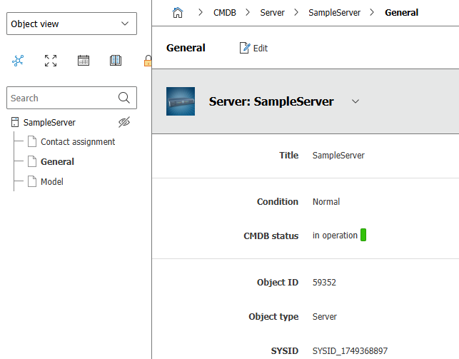
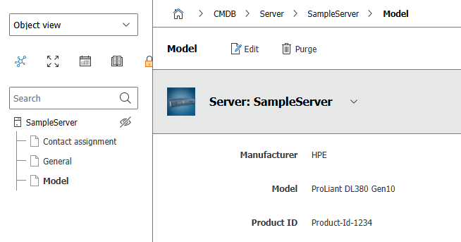

# Mapped objects
## What are mapped objects?
Mapped objects are a way to create PSObjects with a selection of I-doit categories and their values.<br>
Selections can be defined in YAML files. These files are interpreted during `Get-MappedObject` and `Set-MappedObject`to translate from category/attribute to PSCustomObject and vice versa.
## Steps to use Mapped Objects
- Create YAML with the approriate defintions
- Call `Register-IdoitCategoryMap`
- Call `Get-MappedObject -MappingName <'MappingName'>`
## Mapping defintions in YAML
> [!NOTE] About Casing<br>
> All identifiers directly related to I-doit are case-senstive.
> This is valid for
> - Category name (uppercase)
> - Attribute name (usually lowercase)
> - Attribute field name (lowercase)


I use "usually" here, because due to the "flexible" nature of the API implementation, you can not rely on these rules in any case.

### The basic layout
```yaml
<MappingName>:
  Category:
    <category name>:
      <attribute definition>:
        ...
      <attribute definition>:
        ...
    <category name>:
      ...

<NextMappingName>:
  Category:
    ...
```
### Attribute definitions
```yaml
      # content of a simple text attribute (e.g. C__CATG__GLOBAL: title, created_by)
      # examples: changed_by, changed_by.2
      <attribute name>|<attribute name>.<int>:
        <mapping details>
          ...
        <mapping details>
          ...
        ...
      # content of a dropdown box or multi-select (e.g. in CAT__GLOBAL: cmdb_status, type, tags); 'title' is the most common fieldname to use.
      # examples: type.title, type.title.99
      <attribute name>.<fieldname>|<attribute name>.<fieldname>.<int>:
        ...
      # use all of an attribute (e.g. when you want to do special handling with Script Actions - see later)
      '*'|'*.<int>':
        ...
  ...
```
### Mapping details
```yaml
        PSProperty: <PropertyName>      # optional: default <attribute name>
        Action: sum|count|ScriptAction  # optional
        GetScript: |                    # currently only of 'GetScript' is supported
          <multiline script>
```
### Mapping attributes or attribute fields, which return an array
If a category does return an array  there are two variants depending on the category:
- multivalue categories (like C__CATG__CONTACT)
  - This returns an array in general
- categories with field containing an array (like tag@C__CATG__GLOBAL)

```yaml
      # this will return an array with all it's internal representation
      <attribute name>:
        ...
      # this will return an array containing the selected field values
      <attribute name>.<fieldname>:
        ...
```

## How to find out what kind of attribute and attribute values you have to deal with
### Option 1: `Show-IdoitObjectTree`
Most of the time, this quick view can give you a good idea, what kind of attribute/field you are dealing with and how to define it in the mapping yaml.

```powershell
Show-IdoitObjectTree -ObjId 59352 -Style FormatTable        # gives you a quick overview
Show-IdoitObjectTree -ObjId 59352 -Style FormatList         # shows large categories for better reading

# This will return something like this (and yes - currently it is really slow)
Id         : 59352                  # <-- the object returned by Get-IdoitObject
Title      : SampleServer
ObjectType : 5

...
   Category: C__CATG__GLOBAL

id          : 59352
objID       : 59352
# simple text field
title       : SampleServer
# selected from a drop down box
status      : @{id=2; title=Normal; const=; title_lang=LC__CMDB__RECORD_STATUS__NORMAL}
created_by  : wolfgang.wagner@inhouse.wko.at
# selected items of a mutliselect field (returns an array)
tag         : {@{id=8; title=backup}, @{id=9; title=PRD}}
Category    : C__CATG__GLOBAL

# ContactList is an array "by itself"

   Category: C__CATG__CONTACT

id                      : 177
objID                   : 59352
contact                 : @{id=921; title= _Person1; first_name=; last_name=_Person1; mail=person1@spambog.com; ...}
primary_contact         : 2317
contact_object          : @{title= _Person1; id=921; connection_id=2317; type=C__OBJTYPE__PERSON; type_title=Persons; sysid=SYSID_1732173528}
primary                 : @{value=1; title=Yes}
...
Category                : C__CATG__CONTACT

id                      : 178
objID                   : 59352
contact                 : @{id=921; title= _Person1; first_name=; last_name=_Person1; mail=person1@spambog.com; ...}
primary_contact         : 2318
contact_object          : @{title= _Person1; id=921; connection_id=2318; type=C__OBJTYPE__PERSON; type_title=Persons; sysid=SYSID_1732173528}
primary                 : @{value=0; title=No}
...
Category                : C__CATG__CONTACT


   Category: C__CATG__MODEL

id           : 190
objID        : 59352
manufacturer : @{id=4; title=HPE; const=; title_lang=HPE}
```
### Option 2: `Get-IdoitCategoryInfo`
For a detailed view, you can inspect each category by the API. To know what kind of attribute field you are dealing with, "info.type" gives the answer.
```powershell
I ♥ PS Github\PSIdoitNG> Get-IdoItCategoryInfo -Category C__CATG__GLOBAL -OutVariable catInfo
# Here you get all attribute fields and their internal representation
id          : @{title=ID; check=; info=; data=; ui=}
title       : @{title=Title; check=; info=; data=; ui=; format=System.Object[]}
status      : @{title=Condition; check=; info=; data=; ui=; format=}
created     : @{title=Creation date; check=; info=; data=; ui=; format=}
created_by  : @{title=Created by; check=; info=; data=; ui=}
changed     : @{title=Date of change; check=; info=; data=; ui=; format=}
changed_by  : @{title=Last change by; check=; info=; data=; ui=}
purpose     : @{title=Purpose; check=; info=; data=; ui=; format=}
sysid       : @{title=SYSID; check=; info=; data=; ui=}
cmdb_status : @{title=CMDB status; check=; info=; data=; ui=; format=}
type        : @{title=Object type; check=; info=; data=; ui=; format=}
tag         : @{title=Tags; check=; info=; data=; ui=; format=}
description : @{title=Description; check=; info=; data=; ui=}
Category     : C__CATG__MODEL
# Now you can take a depper look
$catinfo.title.info.type        -> text           -> simple text field
$catinfo.cmdb_status.info.type  -> dialog         -> single "full" dropdown object,
$catinfo.tag.info.type          -> multiselect    -> array
```
> [!Note]
> There is a type "dialog_plus" too. When reading from I-doit, it behaves the same as "dialog".<br>
> When setting an attribute of type dialog, you can create new entries, while "dialog" typed attributes can only get already defined values.

# Example of mapping I-doit attributes to a PSObject

## The browser view
Let's look at an example<br>
[](./assets/sample_server_general_small.png)
[](./assets/sample_server_model.png)

## Inspecting the field types
| PSProperty |category|attribute|type|choosen field |
|-|-|-|-|-|
| ComputerName | C__CATG__GLOBAL | title | text | |
| Tag | | tag | multiselect | title |  |
| MyManufacturer | C__CATG__MODEL | manufacturer |dialog_plus | title
| Model | | title | dialog_plus | title |
| ProducId | | productid | text |

## The yaml file
```yaml
Server4YamlDocumentation:
  Category:
  - C__CATG__GLOBAL:
      title:
        PSProperty: ComputerName
      tag.title:
        PSProperty: Tag
  - C__CATG__MODEL:
      manufacturer.title:       # text of a selected dropdown list
        PSProperty: MyManufacturer #    same as above. Give it a different property name
      model.title:              # same as above; property name default (name of field)
      productid:                # simple text field
```
#
### The result
```powershell
I ♥ PS Github\PSIdoitNG> Register-IdoitCategoryMap -Path "$PSScriptRoot/DocsServer4YamlDocs.yaml" -Force
I ♥ PS Github\PSIdoitNG\examples> . 'C:\Users\wagnerw\Lokal\Github\PSIdoitNG\examples\DocsServer4YamlDocs.ps1'

productid    : Product-Id-1234
Manufacturer :
ComputerName : SampleServer
Model        : ProLiant DL380 Gen10
ObjId        : 59352            # this is set by the module automatically
```
## How array attributes are treated
Let's take 'Memory' (C__CATG__MEMORY) as an example.
It returns an array of the defined elements (attrubtes).
The categaory info looks like this:
```powershell
I ♥ PS Github\PSIdoitNG> Get-IdoItCategoryInfo -Category C__CATG__MEMORY -OutVariable catInfo

quantity       : @{title=Quantity; check=; info=; data=; ui=; format=System.Object[]}
title          : @{title=Title; check=; info=; data=; ui=; format=}
manufacturer   : @{title=Manufacturer; check=; info=; data=; ui=; format=}
type           : @{title=Type; check=; info=; data=; ui=; format=}
total_capacity : @{title=Total capacity; check=; info=; data=; ui=; format=System.Object[]}
capacity       : @{title=Capacity; check=; info=; data=; ui=; format=}
unit           : @{title=Memory unit; check=; info=; data=; ui=; format=}
description    : @{title=Description; check=; info=; data=; ui=}
Category       : C__CATG__MEMORY
```
All, exept "Category" (is inserted by the moule function), represent one attribute which is returned.
### configuring default
```yaml
MappingMemory:
  IdoitObjectType: C__OBJTYPE__SERVER
  Category:
    - C__CATG__MEMORY:
      '*.1':
        PSProperty: MemoryDefualt
      '*.2':
        PSProperty: SizeGB
        DisplayFormat: 'SizeGB'
        update: true
```
- Variant '*.1'
  - The destination  property is namend 'MemoryDefualt'
  - * indicates to deliver all elements of that category
  - This will result in an array containing hashtable entries for each memory entry
- Variant 'category..2'
  - - The destination  property is namend 'SizeGB'
  - * indicates to deliver all elements of that category
  - DisplayFormat "SizeGB" overloads tostring() to show each entry as '<num> GB'

Here is an example:
```powershell
I ♥ PS Github\PSIdoitNG> $obj

SizeGB                : {64 GB, 64 GB, 64 GB, 128 GB…}
MemoryDefault         : {@{id=1; objID=540; quantity=; title=; manufacturer=; type=; total_capacity=68719476736; capacity=; unit=; description=; Category=C__CATG__MEMORY}, @{id=2; objID=540; quantity=; title=; manufacturer=; type=; total_capacity=68719476736; capacity=; unit=; description=; Category=C__CATG__MEMORY}, @{id=3; objID=540; quantity=; title=; manufacturer=; type=; total_capacity=68719476736; capacity=; unit=; description=; Category=C__CATG__MEMORY}, @{id=4; objID=540; quantity=; title=; manufacturer=; type=; total_capacity=137438953472; capacity=; unit=; description=; Category=C__CATG__MEMORY}…}
```
## Attention
Category field names are case sensitive!
